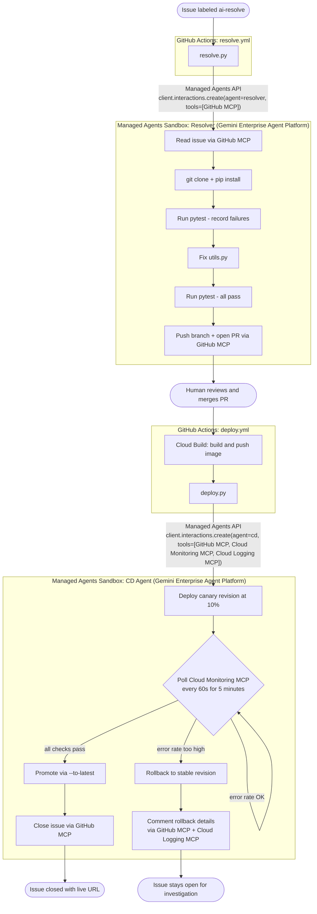

# managed-issue-resolver

Autonomous GitHub issue resolution using the Google Managed Agents API on Gemini Enterprise Agent Platform.

Label any issue `ai-resolve` and a managed agent reads the issue via GitHub MCP, clones the repo, writes a fix, runs the tests, and opens a PR. When the PR merges, a second managed agent deploys the fix to Cloud Run using canary traffic splitting, monitors error rates via Cloud Monitoring MCP, reads logs via Cloud Logging MCP, then promotes or rolls back automatically.

No orchestration framework. No infrastructure to manage: the Managed Agents API provisions a full sandbox (Bash, Python, git, web access) on demand. Two GitHub Actions workflows, two agents, three hosted MCP servers, one GCS bucket for agent files.

## The app

A conference session browser for a developer summit. Shows 12 sessions across 5 tracks (AI & ML, Cloud, Mobile, Web, Security) over 2 days. Attendees can filter by track, filter by day, and search by speaker name.

The filters are broken. Clicking any track filter returns an empty list. Filtering by day also returns nothing. Searching by speaker name is case-sensitive. The session count badge shows the wrong number. All four bugs are in `utils.py`. The agent reads the issue, finds the root cause, fixes the code, and opens a PR.

## How it works



## MCP servers

All three MCP servers are hosted - no deployment or infrastructure required.

| Server | URL | Auth |
|---|---|---|
| GitHub | `https://api.githubcopilot.com/mcp/` | `GITHUB_TOKEN` (auto-provided by GitHub Actions) |
| Cloud Monitoring | `https://monitoring.googleapis.com/mcp` | GCP access token |
| Cloud Logging | `https://logging.googleapis.com/mcp` | GCP access token |

## Structure

```
.github/workflows/
  resolve.yml           # triggered on issue labeled "ai-resolve"
  deploy.yml            # triggered on PR merged to master

resolver/
  resolve.py            # Resolver Agent: calls Managed Agents API
  requirements.txt

cd-agent/
  deploy.py             # CD Agent: calls Managed Agents API
  AGENTS.md             # CD agent identity (uploaded to GCS, mounted at /.agent/AGENTS.md)
  SKILL.md              # canary deploy playbook (uploaded to GCS, mounted at /.agent/skills/deploy/)
  requirements.txt

setup/
  upload_skills.sh      # uploads AGENTS.md and SKILL.md files to GCS bucket
  create_agents.py      # creates named agents on Agent Platform (run once)
  delete_agents.py      # deletes agents (run before recreating)
  test_agents.py        # smoke-tests agents after creation
  reset_demo.sh         # restores bugs, closes open PRs, commits, pushes, redeploys
  teardown.sh           # deletes all cloud resources created during the workshop
  utils_broken.py       # canonical buggy utils.py (source of truth for reset)

target-app/             # the conference session browser
  app.py
  utils.py              # 4 seeded bugs
  templates/
    index.html          # conference schedule UI
  tests/
  conftest.py           # adds target-app/ to sys.path for pytest
  Dockerfile
  requirements.txt
  .agents/
    AGENTS.md           # resolver agent identity (uploaded to GCS, mounted at /.agent/AGENTS.md)
    skills/fix-issue/
      SKILL.md          # fix-issue playbook (uploaded to GCS, mounted at /.agent/skills/fix-issue/)

starter/                # workshop skeleton - participants fill in the TODOs
  setup/
    create_agents.py    # 3 TODOs: system_instruction, tools, base_environment
  resolver/
    resolve.py          # 2 TODOs: build prompt, call interactions.create
  cd-agent/
    AGENTS.md           # TODO: write the safe-deployment rules
    SKILL.md            # TODO: write the canary workflow steps
    deploy.py           # 2 TODOs: build prompt, call interactions.create with 3 MCPs
  target-app/.agents/
    AGENTS.md           # TODO: write the issue-resolver rules
    skills/fix-issue/
      SKILL.md          # TODO: write the fix workflow and critical rules

codelab/
  index.lab.md          # codelab source (Google Codelabs format)
  generate.sh           # runs claat export and writes output to docs/

docs/                   # generated codelab (GitHub Pages source)
  index.html
  codelab.json
  .nojekyll
```

## Codelab

The step-by-step workshop is in `codelab/index.lab.md` (Google Codelabs format). The generated HTML is published from `docs/` via GitHub Pages.

The workshop starter files and codelab are on the **`codelab-workshop`** branch. Participants clone that branch and push as `master` to their own repo:

```bash
git clone --branch codelab-workshop https://github.com/Saoussen-CH/managed-issue-resolver.git
cd managed-issue-resolver
git checkout -b master
```

To regenerate after editing `index.lab.md`:

```bash
# Install claat (one time)
go install github.com/googlecodelabs/tools/claat@latest

# Regenerate docs/
bash codelab/generate.sh
```

## Seeded bugs

| Bug | File | Root cause |
|---|---|---|
| Filter by track returns no sessions | `utils.py:filter_by_track` | Input normalised to "ai-and-ml" but sessions store "AI & ML" |
| Filter by day returns no sessions | `utils.py:filter_by_day` | Day param arrives as string "1", sessions store int 1 |
| Speaker search is case-sensitive | `utils.py:search_by_speaker` | "eric" does not match "Eric Schmidt" |
| Session count shows wrong number | `utils.py:session_count` | Counts all sessions instead of the filtered subset |

## Setup

### 0. Push the repo to GitHub

```bash
git add .
git commit -m "Initial commit"
gh repo create managed-issue-resolver --public --source=. --remote=origin --push
```

### 1. Fill in `.env` and authenticate

```bash
cp .env.example .env
```

Edit `.env` and replace the two placeholder values:

```
GOOGLE_CLOUD_PROJECT=your-project-id
GCS_SKILLS_BUCKET=managed-issue-resolver-skills-your-project-id
```

Then authenticate:

```bash
gcloud auth login
gcloud auth application-default login
gcloud config set project $(grep GOOGLE_CLOUD_PROJECT .env | cut -d= -f2)
```

Verify:

```bash
gcloud auth list
gcloud config get project
```

### 2. Enable APIs

```bash
PROJECT=$(grep GOOGLE_CLOUD_PROJECT .env | cut -d= -f2)

gcloud services enable \
  aiplatform.googleapis.com \
  run.googleapis.com \
  cloudbuild.googleapis.com \
  artifactregistry.googleapis.com \
  monitoring.googleapis.com \
  logging.googleapis.com \
  --project $PROJECT
```

### 3. Create a service account and assign roles

```bash
PROJECT=$(grep GOOGLE_CLOUD_PROJECT .env | cut -d= -f2)
SA=managed-issue-resolver@$PROJECT.iam.gserviceaccount.com

gcloud iam service-accounts create managed-issue-resolver \
  --display-name="Managed Issue Resolver" \
  --project=$PROJECT

for ROLE in \
  roles/aiplatform.user \
  roles/run.admin \
  roles/cloudbuild.builds.editor \
  roles/artifactregistry.writer \
  roles/storage.admin \
  roles/storage.objectViewer \
  roles/mcp.toolUser \
  roles/monitoring.admin \
  roles/logging.admin \
  roles/logging.viewer \
  roles/serviceusage.serviceUsageConsumer \
  roles/iam.serviceAccountUser; do
  gcloud projects add-iam-policy-binding $PROJECT \
    --member="serviceAccount:$SA" \
    --role="$ROLE" --quiet
done
```

### 4. Download the key and add GitHub secrets

```bash
PROJECT=$(grep GOOGLE_CLOUD_PROJECT .env | cut -d= -f2)
SA=managed-issue-resolver@$PROJECT.iam.gserviceaccount.com

gcloud iam service-accounts keys create sa-key.json \
  --iam-account=$SA --project=$PROJECT
```

Add secrets to your GitHub repo (Settings → Secrets and variables → Actions):

```bash
PROJECT=$(grep GOOGLE_CLOUD_PROJECT .env | cut -d= -f2)

gh secret set GCP_SA_KEY < sa-key.json
gh secret set GCP_PROJECT_ID --body "$PROJECT"
gh secret set CLOUD_RUN_REGION --body "us-central1"
# GCS_SKILLS_BUCKET, RESOLVER_AGENT_ID and CD_AGENT_ID are added in step 5
```

Then delete the local key:

```bash
rm sa-key.json
```

`GITHUB_TOKEN` is provided automatically by GitHub Actions. No action needed.

### 4b. Allow GitHub Actions to create pull requests

Go to your GitHub repo: **Settings → Actions → General → Workflow permissions**

Check: **Allow GitHub Actions to create and approve pull requests**

### 5. Create GCS bucket, upload skills, and create named agents

Both AGENTS.md and SKILL.md files are stored in GCS and mounted into the agent sandbox under `/.agent/`. The Antigravity harness auto-discovers `/.agent/AGENTS.md` as the agent's system instruction. AGENTS.md content is also passed as the `system_instruction` parameter at agent creation time. SKILL.md files are mounted at `/.agent/skills/{name}/`. A single GCS source covers both by mounting the `agent-home/` prefix at `/.agent`:

```
gs://{BUCKET}/resolver/agent-home/AGENTS.md              -> /.agent/AGENTS.md
gs://{BUCKET}/resolver/agent-home/skills/fix-issue/      -> /.agent/skills/fix-issue/
```

Agents are created with standard tools (`code_execution`, `google_search`, `url_context`). GitHub MCP and Google MCP servers are added at interaction time using `X-MCP-Exclude-Tools: delete_file` to avoid a name conflict with the sandbox's built-in `delete_file` tool.

```bash
PROJECT=$(grep GOOGLE_CLOUD_PROJECT .env | cut -d= -f2)
GCS_SKILLS_BUCKET=$(grep GCS_SKILLS_BUCKET .env | cut -d= -f2)

gcloud storage buckets create gs://$GCS_SKILLS_BUCKET \
  --location=us-central1 \
  --project=$PROJECT

gh secret set GCS_SKILLS_BUCKET --body "$GCS_SKILLS_BUCKET"

bash setup/upload_skills.sh

uv sync
uv run python setup/create_agents.py
```

The script prints the two agent IDs. Add them as GitHub secrets:

```bash
gh secret set RESOLVER_AGENT_ID --body "managed-issue-resolver"
gh secret set CD_AGENT_ID --body "managed-issue-cd"
```

Verify the agents initialise correctly before triggering the workflow:

```bash
uv run python setup/test_agents.py
```

Agent IDs are permanent. Re-run `upload_skills.sh` + `create_agents.py` only if you change AGENTS.md or SKILL.md files, or delete the agents.

### 6. Create Artifact Registry repo and deploy initial app

```bash
PROJECT=$(grep GOOGLE_CLOUD_PROJECT .env | cut -d= -f2)

gcloud artifacts repositories create managed-issue-resolver \
  --repository-format=docker \
  --location=us-central1 \
  --project=$PROJECT

gcloud run deploy target-app \
  --source target-app/ \
  --region us-central1 \
  --allow-unauthenticated \
  --project=$PROJECT
```

### 7. Trigger a resolution

```bash
# Create the label
gh label create ai-resolve --color "0075ca" --description "Trigger AI issue resolution"

# Open an issue and label it - this triggers the workflow immediately
gh issue create \
  --title "Track filter returns no sessions" \
  --body "When clicking any track filter (AI & ML, Cloud, Mobile, etc.) the session list becomes empty. All sessions disappear regardless of which track is selected. Expected: only sessions matching the selected track should appear. Bug is in \`target-app/utils.py\`." \
  --label "ai-resolve"

# Watch the Actions run
gh run watch

# When the agent opens a PR, review and merge it
gh pr list
gh pr diff 1
gh pr merge 1 --squash --delete-branch
```

Merging the PR triggers the CD agent, which deploys the fix and closes the issue automatically.

### Reset for another run

After the demo completes, run:

```bash
bash setup/reset_demo.sh
```

This waits for any in-progress CD workflows, closes open PRs, restores the 4 bugs in `utils.py`, then pushes to master (force-push if the agent's merged fix is ahead of local) and redeploys the broken app to Cloud Run. Then open a new issue with the `ai-resolve` label.
