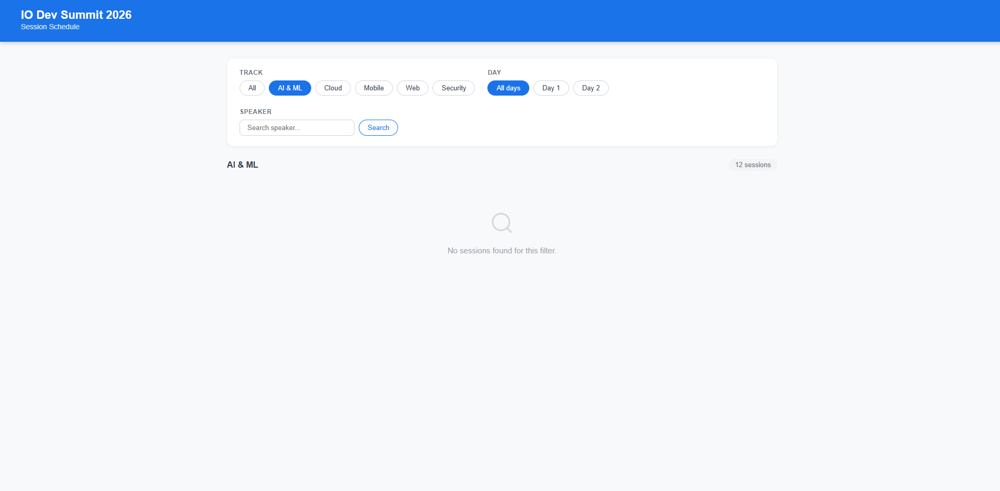
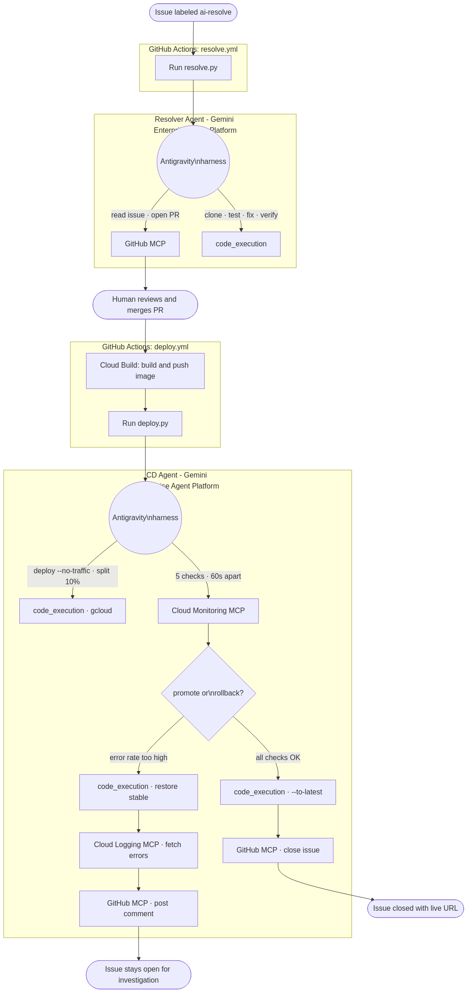
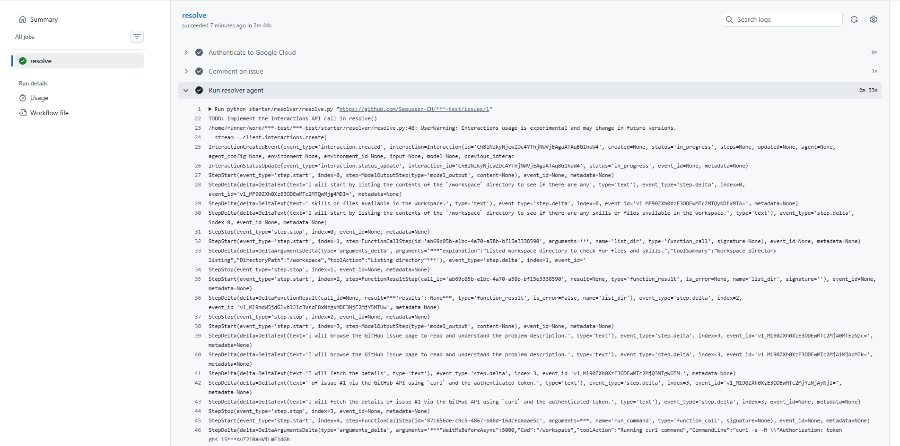
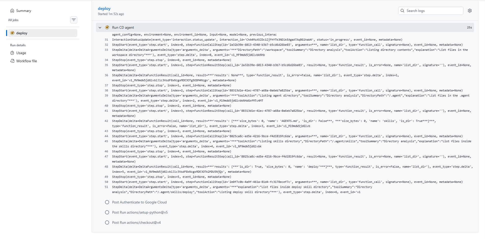
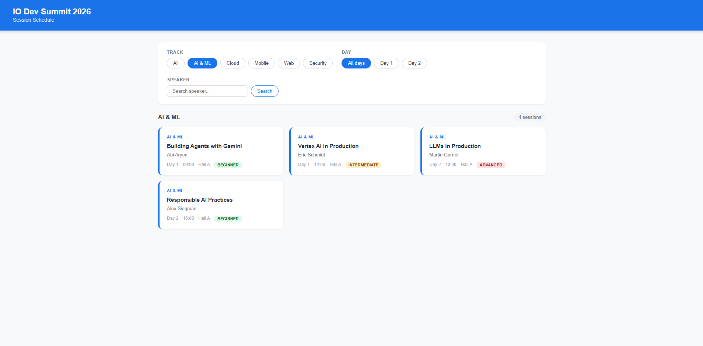

# Build a GitHub Issue Resolver with Managed Agents in the Gemini API

Enable_GDP_Credits_Banner: True

> aside negative
>
> If you are attending an **instructor-led workshop**: Your instructor will provide you with a credit code. Please use
> the one they provide.

## Overview

Duration: 05:00

In this codelab you will build a **GitHub Issue Resolver**: a system that autonomously resolves GitHub issues and
deploys fixes to Cloud Run, driven entirely by the Managed Agents API on Gemini Enterprise Agent Platform.

Label any issue `ai-resolve`. A managed agent reads the issue via GitHub MCP, clones the repo, reproduces the
failure, fixes the bug, runs the tests, and opens a PR. When you merge the PR, a second managed agent deploys the
fix to Cloud Run using canary traffic splitting, monitors error rates via Cloud Monitoring MCP, then promotes or
rolls back automatically.

No orchestration framework. No LLM wrappers. No custom sandboxes. The platform provisions the sandbox, runs the
model, executes code, and streams results. You bring two AGENTS.md files, two SKILL.md files, two Python scripts,
and three hosted MCP servers.

### What you'll learn

- Write **AGENTS.md** (agent identity and constraints) and **SKILL.md** (step-by-step playbook), and understand why they are separate files owned by different teams.
- Use the **Agents API** (control plane) to register named agents once, with GCS-mounted skill files and built-in tools.
- Use the **Interactions API** (data plane) to invoke agents at runtime with `background=True`, `stream=True`, and `store=True`.
- Attach **hosted MCP servers** (GitHub, Cloud Monitoring, Cloud Logging) at call time with no deployment required.
- Implement **canary traffic splitting** on Cloud Run with automated promotion and rollback driven by an agent.

### What you'll need

- A Google Cloud project with billing enabled
- A GitHub account
- The `gcloud` CLI and `gh` CLI installed and authenticated
- Python 3.11+ and `uv` installed

## Set Up Your Environment

Duration: 15:00

For this codelab you'll use Cloud Shell or your local terminal. By the end of this step you'll have the repo
cloned, your GCP project configured, all required APIs enabled, a `.env` file filled in, a service account
created, and GitHub secrets set.

### What is Cloud Shell?

Cloud Shell is a free browser-based Linux terminal with `gcloud`, `git`, `gh`, `uv`, and Python pre-installed.
You don't need to install anything locally to complete this codelab.

To open Cloud Shell, click the terminal icon in the top-right toolbar of the GCP Console. When prompted, click
**Authorize** to allow Cloud Shell to make Google Cloud API calls.

> aside negative
>
> **If Cloud Shell goes idle for 20 minutes it will disconnect.** Reconnect and `cd github-issue-resolver` to
> return to the working directory.

> aside positive
>
> **Prefer your local terminal?** You'll need `gcloud` CLI, `gh` CLI, `uv`, and Python 3.11+ installed.
> Everything else in this codelab runs identically.

### Create your GitHub repo from the template

This codelab uses a GitHub template repository. You get your own ready-to-run copy with one click — no branch
gymnastics required.

1. Go to [github.com/Saoussen-CH/github-issue-resolver](https://github.com/Saoussen-CH/github-issue-resolver)
2. Click **Use this template** → **Create a new repository**
3. Name it `github-issue-resolver`, select **Public**, click **Create repository**

> aside positive
>
> **Why public?** The `GITHUB_TOKEN` that GitHub Actions provides automatically has `contents: write` and
> `pull-requests: write` permissions by default on public repos. Private repos require additional configuration.

### Clone your repo

```bash
gh auth login
REPO=$(gh api user --jq '.login')/github-issue-resolver
git clone https://github.com/$REPO.git
cd github-issue-resolver
```

### Authenticate and configure your project

```bash
gcloud auth login
gcloud auth application-default login
```

> aside positive
>
> **Why two auth commands?** `gcloud auth login` authenticates the CLI. `gcloud auth application-default login`
> creates credentials that Python scripts (`create_agents.py`, `deploy.py`) use to call Google Cloud APIs.
> Without the second command, the agent SDK fails with a missing credentials error at runtime.

Then set your project:

```bash
export PROJECT_ID=$(gcloud config get-value project)
export REGION="us-central1"
echo "Project: $PROJECT_ID"
```

Expected output:
```text
Project: my-project-123
```

### Enable required APIs

```bash
gcloud services enable \
    aiplatform.googleapis.com \
    run.googleapis.com \
    cloudbuild.googleapis.com \
    artifactregistry.googleapis.com \
    monitoring.googleapis.com \
    logging.googleapis.com \
    storage.googleapis.com \
    --project $PROJECT_ID
```

This takes about 1 minute. You'll see `Operation finished successfully` when done.

> aside positive
>
> **Why these APIs?** `aiplatform.googleapis.com` is the Managed Agents API. The rest support Cloud Run
> deployment (`run`, `cloudbuild`, `artifactregistry`), skill file storage (`storage`), and the hosted MCP
> servers for monitoring and logging.

### Fill in .env

Both placeholder values contain `your-project-id`, so one `sed` command fills them both using the `PROJECT_ID` variable you set above:

```bash
cp .env.example .env
sed -i "s/your-project-id/$PROJECT_ID/g" .env
```

Verify:

```bash
cat .env
```

Expected output:
```text
GOOGLE_CLOUD_PROJECT=my-project-123
GCS_SKILLS_BUCKET=managed-issue-resolver-skills-my-project-123
CLOUD_RUN_REGION=us-central1
CLOUD_RUN_SERVICE=target-app
```

Install Python dependencies:

```bash
uv sync
```

### Create a service account

The GitHub Actions workflows need GCP credentials to call the Managed Agents API, build Docker images, and
deploy to Cloud Run. Create a dedicated service account with the exact roles needed:

```bash
PROJECT_ID=$(grep GOOGLE_CLOUD_PROJECT .env | cut -d= -f2)
SA=managed-issue-resolver@$PROJECT_ID.iam.gserviceaccount.com

gcloud iam service-accounts create managed-issue-resolver \
  --display-name="Managed Issue Resolver" \
  --project=$PROJECT_ID
```

Assign roles:

```bash
for ROLE in \
  roles/aiplatform.user \
  roles/run.admin \
  roles/cloudbuild.builds.editor \
  roles/artifactregistry.writer \
  roles/storage.admin \
  roles/storage.objectViewer \
  roles/mcp.toolUser \
  roles/monitoring.admin \
  roles/logging.admin \
  roles/logging.viewer \
  roles/serviceusage.serviceUsageConsumer \
  roles/iam.serviceAccountUser; do
  gcloud projects add-iam-policy-binding $PROJECT_ID \
    --member="serviceAccount:$SA" \
    --role="$ROLE" --quiet
done
```

Download the key:

```bash
gcloud iam service-accounts keys create sa-key.json \
  --iam-account=$SA --project=$PROJECT_ID
```

> aside negative
>
> **Never commit `sa-key.json`.** The `.gitignore` already excludes it. Always delete the local copy after
> adding it to GitHub Secrets in the next step.

> aside positive
>
> **Why `roles/mcp.toolUser`?** The Cloud Monitoring and Cloud Logging MCP servers require this role to accept
> authenticated requests. Without it, the CD agent gets `403 Forbidden` when querying error rates.

### Add GitHub secrets

The workflows read secrets from the repository. Add them before the first run:

```bash
PROJECT_ID=$(grep GOOGLE_CLOUD_PROJECT .env | cut -d= -f2)
REPO=$(gh api user --jq '.login')/github-issue-resolver

gh secret set GCP_SA_KEY --repo "$REPO" < sa-key.json
gh secret set GCP_PROJECT_ID --body "$PROJECT_ID" --repo "$REPO"
gh secret set CLOUD_RUN_REGION --body "us-central1" --repo "$REPO"
```

Then delete the local key file:

```bash
rm sa-key.json
```

`GITHUB_TOKEN` is provided automatically by GitHub Actions (no action needed).

> aside negative
>
> **Allow pull request creation.** Go to your GitHub repo: **Settings > Actions > General > Workflow
> permissions**. Check: **Allow GitHub Actions to create and approve pull requests**. Without this, the
> resolver agent cannot open a PR and the workflow will fail with a `403` error.

The secrets `RESOLVER_AGENT_ID` and `CD_AGENT_ID` will be added in the next steps after the agents are created.

## What You'll Fix and How

Duration: 05:00

Before writing any agent code, deploy the app and see the bugs for yourself. Then you'll see the two-agent architecture that fixes them.

The target app is a **conference session browser** — 12 sessions across 5 tracks (AI & ML, Cloud, Mobile, Web,
Security) over 2 days. It has four seeded bugs, all in `utils.py`:

| Bug | Symptom | Root cause |
|---|---|---|
| Filter by track | Clicking any track filter returns an empty list | Input normalised to `"ai-and-ml"` but sessions store `"AI & ML"` |
| Filter by day | Filtering by Day 1 or Day 2 returns nothing | Day param arrives as string `"1"`, sessions store int `1` |
| Speaker search | `"eric"` does not match `"Eric Schmidt"` | Case-sensitive comparison |
| Session count | The count badge shows the wrong number | Counts all sessions instead of the filtered subset |

### The app you'll fix

Create an Artifact Registry repository for Docker images:

```bash
PROJECT_ID=$(grep GOOGLE_CLOUD_PROJECT .env | cut -d= -f2)

gcloud artifacts repositories create managed-issue-resolver \
  --repository-format=docker \
  --location=us-central1 \
  --project=$PROJECT_ID
```

Deploy the initial (broken) version to Cloud Run:

```bash
gcloud run deploy target-app \
  --source target-app/ \
  --region us-central1 \
  --allow-unauthenticated \
  --project=$PROJECT_ID
```

This takes 2-3 minutes. When complete, you'll see:

```text
Service URL: https://target-app-xxxx.us-central1.run.app
```

Open the URL in your browser. Click any track filter — notice the session list goes empty. That is bug #1.



> aside negative
>
> **`--allow-unauthenticated` is intentional here.** It makes the app publicly accessible for demo purposes.
> In production, remove this flag and add IAM-based authentication.

### How you'll fix it



Two managed agents handle the full lifecycle:

1. **Resolver agent** — triggered by the `ai-resolve` label: reads the issue, clones the repo, runs tests,
   fixes `utils.py`, and opens a PR.
2. **CD agent** — triggered when the PR merges: deploys the fix to Cloud Run with canary traffic splitting,
   monitors error rates via Cloud Monitoring MCP, then promotes or rolls back automatically.

You review and merge the PR. Everything else is autonomous.

## What is the Managed Agents API?

Duration: 05:00

Before writing any code, let's understand the platform you are building on.

Most LLM APIs give you text-in, text-out: you send a prompt, the model returns a response. That is enough for
summarization or Q&A. It is not enough for resolving a GitHub issue - the agent needs to clone a repo, run
tests, write files, and open a PR. For that, the model needs real compute.

The **Managed Agents API** (part of Gemini Enterprise Agent Platform) runs a Gemini model inside a fully
provisioned Ubuntu sandbox. The model and the compute environment are co-located: the model can run `bash`,
execute Python, call `git`, run `pytest`, and make HTTP requests as part of a single interaction.

```text
Your code (GitHub Actions workflow)
        │
        │  client.interactions.create(agent="managed-issue-resolver", ...)
        ▼
  Gemini Enterprise Agent Platform
        │
        ├─ provisions sandboxed Ubuntu environment
        ├─ mounts skill files from GCS at /.agent/
        ├─ starts Gemini model alongside the compute
        │
        │  agent reasons → calls bash → runs pytest → edits files → calls GitHub MCP → opens PR
        │
        └─ streams interaction events back to your workflow
```

**Why not roll your own?**

| | Managed Agents API | Self-hosted (e.g., LangChain + Docker) |
|---|---|---|
| Infrastructure | Zero - platform provisions on demand | You build, deploy, and scale execution environments |
| Sandbox security | Isolated per interaction, auto-cleaned | You manage isolation |
| Long-running tasks | Background execution, up to 15 min | You handle timeouts and polling |
| MCP integration | Hosted MCP servers passed at call time | You deploy or proxy MCP servers |
| SDK | Three lines to invoke | Framework-specific, more code |

### Two APIs, two planes

The system is split into a **control plane** and a **data plane**. This is the most important design concept in
the whole codelab.

**Agents API (control plane):** Creates and configures named agents. Runs once during setup.

```python
client.agents.create(
    id="managed-issue-resolver",
    base_agent="antigravity-preview-05-2026",
    system_instruction=agents_md_content,   # who the agent is
    tools=[...],                             # built-in capabilities
    base_environment={...},                  # GCS skill files + network rules
)
```

**Interactions API (data plane):** Invokes a named agent for a specific task. Runs on every workflow trigger.

```python
stream = client.interactions.create(
    agent="managed-issue-resolver",   # references the named agent by ID
    input=prompt,                      # the task for this run
    tools=[github_mcp_server],         # per-run tools (GitHub token changes every run)
    stream=True, background=True, store=True,
)
```

The named agent ID is the bridge: created once on the control plane, referenced many times on the data plane.
Configuration is registered once; invocation is lightweight.

> aside positive
>
> **Why is GitHub MCP at interaction time?** The GitHub token comes from the GitHub Actions runner and is
> different for every repository and every run. It cannot be baked into the named agent at creation time.

## Write the Resolver Agent

Duration: 08:00

The resolver agent needs two files before it can run:

- **AGENTS.md** - defines the agent's identity, role, and hard constraints. Loaded before every interaction.
- **SKILL.md** - defines the step-by-step workflow for this class of task. Mounted as a file the agent reads.

### Concept: AGENTS.md and SKILL.md

Think of them like two different documents in an operations team:

| | AGENTS.md | SKILL.md |
|---|---|---|
| **What it defines** | Agent identity, role, and constraints | Step-by-step operational procedure |
| **Written by** | Security and compliance teams | Operations teams |
| **Stored where** | GCS, mounted at `/.agent/AGENTS.md` | GCS, mounted at `/.agent/skills/{name}/` |
| **Also passed as** | `system_instruction` at agent creation | (mounted file only) |
| **Update path** | Upload new GCS file, recreate agent | Upload new GCS file, recreate agent |

Put in **AGENTS.md** anything that defines what the agent IS and what it MUST NOT do:
- Role and expertise ("You are a senior software engineer")
- Hard constraints ("Never modify files outside `target-app/`")
- Non-negotiable rules ("If tests pass before your change, they must pass after")

Put in **SKILL.md** anything that defines HOW to do a specific task:
- Step-by-step workflow (clone, install, test, fix, push)
- Tool usage notes ("Use the GitHub MCP server for all GitHub API calls")
- Decision logic ("If tests fail after fix, iterate before opening PR")

> aside negative
>
> **On Gemini Enterprise Agent Platform, you cannot mount two GCS sources under the same top-level
> directory.** Both files must share one GCS prefix, mounted as a single source at `/.agent`. This project
> uses `agent-home/` as that shared prefix:
>
> ```
> gs://{BUCKET}/resolver/agent-home/AGENTS.md              -> /.agent/AGENTS.md
> gs://{BUCKET}/resolver/agent-home/skills/fix-issue/      -> /.agent/skills/fix-issue/
> ```

### Open the resolver AGENTS.md

```bash
cloudshell edit starter/target-app/.agents/AGENTS.md
```

You'll see a `<!-- TODO -->` comment for the `## Rules` section. The persona is already filled in.

### TODO - Add the Rules section

The rules exist to prevent failure modes that are specific to unrestricted code execution.
Without them the agent might: create helper files instead of editing the broken one, patch a
symptom without fixing the root cause, or open a PR while tests still fail.

Each rule maps to one real failure mode:

| Rule | What failure it prevents |
|---|---|
| Never create new files to apply a fix | Keeps the PR diff minimal; helper files leave the root cause in place |
| Never fix a symptom, fix the root cause | Prevents editing test assertions to match wrong behavior |
| Tests must all pass before opening a PR | Hard quality gate - the agent iterates, not you |
| Do not refactor anything unrelated to the issue | One PR, one fix - clean and reviewable history |
| If you cannot locate the bug, describe what you found and stop | Fail-safe against silent partial fixes |

Replace the `<!-- TODO -->` comment with:

```markdown
- Never create new files to apply a fix. Edit the file that contains the bug.
- Never fix a symptom when you can fix the root cause.
- If tests pass before your change, they must all pass after it too.
- Do not add comments unless the fix is genuinely non-obvious.
- Do not refactor, rename, or clean up anything unrelated to the issue.
- If you cannot confidently locate the bug after exploring the codebase, open a PR describing what you found and stop - do not guess.
```

Compare your file with `target-app/.agents/AGENTS.md` when done.

### Open the resolver SKILL.md

```bash
cloudshell edit "starter/target-app/.agents/skills/fix-issue/SKILL.md"
```

You'll see two `<!-- TODO -->` comment blocks: one for `## Workflow` and one for `## Critical rules`. The trigger
and tools sections at the top are already filled in.

### TODO - Add the Workflow and Critical Rules

The workflow gives the agent a step-by-step runbook for this class of task. Steps 1-3 are orientation before
action: the agent must understand the codebase before it touches anything. Step 4 establishes a failure
baseline so the agent verifies its fix addresses exactly the right behavior. Step 8 includes the `git config`
lines that are critical: the managed sandbox starts with no git identity configured, and `git commit` fails
without them.

Replace the `<!-- TODO -->` comment inside `## Workflow` with:

````markdown
1. Read the issue using the GitHub MCP server to get the title, body, and number.

2. Clone the repository and read its structure:
   ```bash
   git clone <auth_repo_url> /workspace/repo
   cd /workspace/repo && ls -la
   ```

3. Install dependencies (check for `requirements.txt`, `package.json`, `pyproject.toml`).

4. Run the existing tests to see the current failure baseline.

5. Diagnose the issue using the symptom-to-location playbook.

6. Write the fix. Change only the code that causes the reported behavior.

7. Run the tests again. If any fail, iterate. Do not open a PR until all pass.

8. Commit and push:
   ```bash
   git config user.email "agent@managed-agents.dev"
   git config user.name "Issue Resolver Agent"
   git checkout -b fix/issue-<ISSUE_NUMBER>
   git add -A
   git commit -m "fix: <description> (closes #<ISSUE_NUMBER>)"
   git push origin fix/issue-<ISSUE_NUMBER>
   ```

9. Open a PR via GitHub MCP. Post a comment on the issue with the PR URL.
````

Replace the `<!-- TODO -->` comment inside `## Critical rules` with:

```markdown
- **MANDATORY: run the full test suite before opening a PR.**
- **Do NOT create new files to apply a fix.**
- **Do NOT open a PR if any tests fail.** Iterate until they pass.
```

Compare your file with `target-app/.agents/skills/fix-issue/SKILL.md` when done.

## Write the CD Agent

Duration: 08:00

The CD agent deploys the fix to Cloud Run using canary traffic splitting, monitors error rates for 5 minutes,
then promotes or rolls back automatically. Like the resolver, it needs an AGENTS.md and a SKILL.md.

### Concept: The CD AGENTS.md rules

The CD agent has code execution and network access. Without explicit rules it would make unsafe deployment
decisions:

| Rule | What failure it prevents |
|---|---|
| Always record the stable revision before deploying | Rollback is impossible without it - Cloud Run has no "undo" for traffic splits |
| Never use `gcloud logging read` for health decisions | Log ingestion has 30-90 second delay and no denominator - logs cannot compute error rate |
| Never close the issue on rollback | The fix did not reach production - closing signals false success to the team |
| If no linked issue found in PR, skip GitHub steps | Not every PR has an issue reference; the agent should still complete the deploy |

### Open the CD AGENTS.md

```bash
cloudshell edit starter/cd-agent/AGENTS.md
```

The persona and 6-step high-level workflow are pre-filled. You'll see a `<!-- TODO -->` comment for the `## Rules`
section.

### TODO - Add the CD Rules

Replace the `<!-- TODO -->` comment with:

```markdown
- Always record the stable revision before deploying. Rollback is impossible without it.
- Never use `gcloud logging read` for health decisions. Use Cloud Monitoring MCP for metrics.
- Never close the issue on rollback. The fix did not reach production.
- If no linked issue is found in the PR body, skip the GitHub steps entirely.
```

Compare your file with `cd-agent/AGENTS.md` when done.

### Concept: The canary monitoring playbook

The SKILL.md for the CD agent defines the full canary deploy workflow, including the verdict table the agent
applies at each monitoring check:

| Condition | Verdict |
|---|---|
| `canary_total < 5` | HOLD (not enough traffic yet - denominator too small) |
| `canary_error_rate > 0.05` AND `> stable_error_rate * 2` | ROLLBACK |
| `canary_error_rate <= 0.05` | OK |
| Two consecutive HOLDs | ROLLBACK (no traffic reaching canary) |

The agent runs 5 checks, 60 seconds apart. ROLLBACK triggers immediately on any check. Promotion requires all
5 checks to pass.

**Why `canary_total < 5` (HOLD)?** A denominator guard. If only 2 requests have reached the canary, one error
gives a 50% error rate - statistical noise, not a real failure. HOLD prevents false ROLLBACKs on a quiet
canary window.

**Why `canary_error_rate > 0.05 AND > stable_error_rate * 2`?** Both conditions must be true. A 3% canary
error rate is acceptable if the stable revision is also running at 2% - that is a shared infrastructure issue,
not a regression. Requiring 2x stable as the threshold filters out baseline noise.

**Why `--to-latest` on promotion?** If you use `--to-revisions NEW_REV=100`, Cloud Run enters "manual traffic
mode." Future deployments create new revisions but get no traffic until you manually update the traffic config.
`--to-latest` keeps the service in automatic mode where each new deploy automatically becomes active.

### Open the CD SKILL.md

```bash
cloudshell edit starter/cd-agent/SKILL.md
```

The trigger and tools sections are pre-filled. You'll see two `<!-- TODO -->` comment blocks: one for `## Steps` and
one for `## Critical rules`.

### TODO - Add the Steps and Critical Rules

The 12-step workflow covers: authenticate, record stable revision, deploy with `--no-traffic`, get new
revision name, split traffic at 10%, run the monitoring loop with the verdict table, promote or roll back,
get the service URL, extract the issue number from the PR body, and post the result.

Replace the `<!-- TODO -->` comment inside `## Steps` with:

````markdown
1. **Authenticate gcloud** using the access token from the prompt:
   ```bash
   export CLOUDSDK_AUTH_ACCESS_TOKEN=<token_from_prompt>
   ```

2. **Record the stable revision** before any change:
   ```bash
   gcloud run revisions list --service <SERVICE> --region <REGION> --project <PROJECT> \
     --format="value(REVISION)" --limit=1
   ```
   Save this as STABLE_REV. This is the rollback target.

3. **Deploy the new image with no traffic**:
   ```bash
   gcloud run deploy <SERVICE> \
     --image <IMAGE_URL> \
     --region <REGION> --project <PROJECT> \
     --no-traffic --quiet
   ```

4. **Get the new revision name**:
   ```bash
   gcloud run revisions list --service <SERVICE> --region <REGION> --project <PROJECT> \
     --format="value(REVISION)" --limit=1
   ```
   Save this as NEW_REV.

5. **Split traffic at 10%**:
   ```bash
   gcloud run services update-traffic <SERVICE> \
     --region <REGION> --project <PROJECT> \
     --to-revisions NEW_REV=10,STABLE_REV=90
   ```

6. **Monitoring loop** - run 5 checks, 60 seconds apart, using Cloud Monitoring MCP:
   - Query `run.googleapis.com/request_count` for the last 2 minutes, grouped by `response_code_class`
   - Compute canary_error_rate and stable_error_rate from 5xx vs total
   - Apply the verdict table:

   | Condition | Verdict |
   |---|---|
   | canary_total < 5 | HOLD |
   | canary_error_rate > 0.05 AND > stable_error_rate * 2 | ROLLBACK |
   | canary_error_rate <= 0.05 | OK |
   | Two consecutive HOLDs | ROLLBACK |

   Stop immediately on ROLLBACK. Proceed to step 7 after all 5 checks pass as OK.

7. **Promote** (all checks OK):
   ```bash
   gcloud run services update-traffic <SERVICE> --region <REGION> --project <PROJECT> --to-latest
   ```

   **Or rollback** (any ROLLBACK verdict):
   ```bash
   gcloud run services update-traffic <SERVICE> --region <REGION> --project <PROJECT> \
     --to-revisions STABLE_REV=100
   ```

8. **Get the service URL**:
   ```bash
   gcloud run services describe <SERVICE> --region <REGION> --project <PROJECT> \
     --format="value(status.url)"
   ```

9. **Find the linked issue number** from the PR body: look for "Closes #N" or "Fixes #N".

10. **On success**: post a comment on the issue with the revision name and live URL, then close the issue via GitHub MCP.

11. **On rollback**: use Cloud Logging MCP to fetch the top 5 recent error log entries for the service.
    Post a comment on the issue with the error rate, rollback reason, and log entries. Do NOT close the issue.

12. If no linked issue is found, skip GitHub steps - the deployment result is complete.
````

Replace the `<!-- TODO -->` comment inside `## Critical rules` with:

```markdown
- **Always record STABLE_REV before step 3.** Rollback is impossible without it.
- **Never use Cloud Logging for the promote/rollback decision.** Use Cloud Monitoring MCP only.
- **Never close the issue on rollback.** The fix did not reach production.
```

Compare your file with `cd-agent/SKILL.md` when done.

## Create Named Agents

Duration: 08:00

You have the agent files. Now you'll upload them to GCS and register the two named agents on Gemini Enterprise
Agent Platform.

### Concept: The Antigravity harness

Every managed agent runs on the **Antigravity harness** - the execution engine that powers Gemini Enterprise
Agent Platform. The `base_agent` field in `client.agents.create()` pins the harness version:

```python
client.agents.create(
    id="managed-issue-resolver",
    base_agent="antigravity-preview-05-2026",   # pins the harness version
    ...
)
```

The harness ships a full Ubuntu environment pre-installed with everything the agent needs:

| Software | Version |
|---|---|
| Python | 3.11 |
| Node.js | 20 |
| gcloud CLI | Latest |
| git, curl, jq, pytest, pip | Latest |
| ripgrep, fd, tree | Latest |

Built-in tools are activated at agent creation and cannot be changed without recreating the agent:

| Tool type | What the agent gains |
|---|---|
| `code_execution` | Run bash and Python with stdout/stderr capture |
| `google_search` | Web search from inside the sandbox |
| `url_context` | Fetch and read web pages |

**Network access is disabled by default.** Our project uses `{"domain": "*"}` to permit all outbound
connections (required for `git clone`, `git push`, and MCP calls). In production, replace `*` with specific
domains to enforce a tight egress policy.

> aside positive
>
> **Why pin the harness version?** Using `base_agent="antigravity-preview-05-2026"` pins your agents to a
> specific harness version. Your agents always run on the same execution environment unless you explicitly
> recreate them with a newer `base_agent`. This makes upgrades explicit and predictable.

### Upload agent files to GCS

Both AGENTS.md and SKILL.md files are stored in GCS and mounted into the sandbox at `/.agent/`. Create the
bucket and upload all files:

```bash
PROJECT_ID=$(grep GOOGLE_CLOUD_PROJECT .env | cut -d= -f2)
GCS_SKILLS_BUCKET=$(grep GCS_SKILLS_BUCKET .env | cut -d= -f2)

gcloud storage buckets create gs://$GCS_SKILLS_BUCKET \
  --location=us-central1 \
  --project=$PROJECT_ID
```

Upload all AGENTS.md and SKILL.md files:

```bash
bash setup/upload_skills.sh
```

Expected output:
```text
Uploading agent-home directories to gs://managed-issue-resolver-skills-my-project ...
(agent-home/ contains AGENTS.md + skills/ - single mount at /.agent)
[gsutil copy output]

Uploaded:
gs://managed-issue-resolver-skills-my-project/cd-agent/agent-home/AGENTS.md
gs://managed-issue-resolver-skills-my-project/cd-agent/agent-home/skills/deploy/SKILL.md
gs://managed-issue-resolver-skills-my-project/resolver/agent-home/AGENTS.md
gs://managed-issue-resolver-skills-my-project/resolver/agent-home/skills/fix-issue/SKILL.md

Note: recreate agents after changing SKILL.md or AGENTS.md files:
  uv run python starter/setup/create_agents.py
```

> aside positive
>
> **Re-run `upload_skills.sh` whenever you edit AGENTS.md or SKILL.md.** Both files are baked into the agent's
> base environment snapshot at creation time - the sandbox does not re-fetch from GCS on each interaction.
> Upload first, then recreate the agents to pick up the latest content.

### Open create_agents.py

```bash
cloudshell edit starter/setup/create_agents.py
```

The client initialization, file reads, function signature, and polling loop are pre-filled. You'll see three
`# TODO` comments inside the `client.agents.create()` call. Work through them in order.

### TODO 1 - Pass `system_instruction`

The `system_instruction` variable is already read from the AGENTS.md file at the top of the file. Pass it
directly to the API:

```python
        system_instruction=system_instruction,
```

This is stored in the agent definition on the control plane and applied before every interaction. It is the
same content that `upload_skills.sh` uploads to GCS at `/.agent/AGENTS.md` - both paths carry the same text.
The parameter is stored at agent creation; the GCS file is read at runtime by the harness.

### TODO 2 - Add the `tools` list

Built-in tool capabilities are activated at agent creation time and cannot be added later without recreating
the agent:

```python
        tools=[
            {"type": "code_execution"},
            {"type": "google_search"},
            {"type": "url_context"},
        ],
```

**`code_execution`** gives the agent a full bash and Python environment - `git`, `pytest`, `pip`, and all
standard Unix tools. Without this, the agent can only produce text; it cannot run any commands.

**`google_search`** allows the agent to search the web. The resolver does not use it for the fix workflow,
but it is available if the agent needs to look up an error message it encounters.

**`url_context`** lets the agent fetch and read the content at a URL. Useful if the issue body contains a
link to a relevant doc or stack trace.

### TODO 3 - Add `base_environment`

The base environment defines the sandbox and what files are pre-loaded when it starts:

```python
        base_environment={
            "type": "remote",
            "sources": [
                {
                    "type": "gcs",
                    "source": f"gs://{GCS_SKILLS_BUCKET}/{agent_home_gcs_prefix}",
                    "target": "/.agent",
                }
            ],
            "network": {"allowlist": [{"domain": "*"}]},
        },
```

**`"type": "remote"`** - a managed hosted sandbox provisioned by the platform. The agent does not run locally.

**`"source": f"gs://.../{agent_home_gcs_prefix}"`** - the GCS prefix is mounted as a directory, not a single
file. Everything under `resolver/agent-home/` lands at `/.agent/` in the sandbox: `AGENTS.md` at
`/.agent/AGENTS.md` and the skill at `/.agent/skills/fix-issue/SKILL.md`. This is why both files must share
one GCS prefix - the API rejects two sources that would share the same top-level target directory.

**`"target": "/.agent"`** - the Antigravity harness auto-discovers `/.agent/AGENTS.md` as the runtime system
instruction and loads skill files from `/.agent/skills/`.

**`"network": {"allowlist": [{"domain": "*"}]}`** - network access is disabled by default. The `*` allowlist
enables all outbound connections - required for `git clone`, `git push`, and the GitHub MCP server.

Your file is ready to run. Verify it by registering the agents in the next step.

### Register agents

Run your completed starter file to register both named agents on Gemini Enterprise Agent Platform:

```bash
uv run python starter/setup/create_agents.py
```

The script prints the `gh secret set` commands for both agent IDs. Run them:

```bash
REPO=$(gh api user --jq '.login')/github-issue-resolver
gh secret set RESOLVER_AGENT_ID --body "managed-issue-resolver" --repo "$REPO"
gh secret set CD_AGENT_ID --body "managed-issue-cd" --repo "$REPO"
```

### Verify the agents

Run the smoke test before triggering any workflow:

```bash
uv run python setup/test_agents.py
```

Expected output:
```text
Testing: managed-issue-resolver
  Prompt: Say hello and confirm you can access the GitHub MCP server.
  interaction.created
  PASS: agent initialized and completed successfully

Testing: managed-issue-cd
  Prompt: Say hello and confirm you can access the GitHub, Cloud Monitoring, and Cloud Logging MCP servers.
  interaction.created
  PASS: agent initialized and completed successfully

========================================
All agents OK. Ready to trigger the workflow.
```

> aside positive
>
> **Agent IDs are permanent.** Once created, the agent ID never changes. Re-run `upload_skills.sh` then
> recreate the agents only if you change AGENTS.md or SKILL.md files, or delete the agents. The GitHub
> secrets never need updating once set.

> aside negative
>
> **If you see `GOOGLE_CLOUD_PROJECT: KeyError`**, your `.env` file is not filled in or not being loaded.
> Check that `GOOGLE_CLOUD_PROJECT=your-project-id` is set in `.env` and that you ran the command from the
> repo root.

## Invoke the Resolver Agent

Duration: 08:00

The resolver workflow fires when a GitHub issue gets the `ai-resolve` label. The workflow calls `resolve.py`,
which invokes the resolver agent via the Interactions API. Let's write that script.

### Concept: The Interactions API

The Interactions API is the data plane: it invokes a named agent for a specific task. Three parameters make it
suitable for long-running agent tasks:

| Parameter | Why this project uses it |
|---|---|
| `background=True` | Agent tasks run up to 15 minutes; this prevents the GitHub Actions step from timing out while waiting |
| `stream=True` | Yields live events (text chunks, tool calls, tool results) so the workflow log shows progress in real time |
| `store=True` | Persists the interaction so a follow-up call can resume it via `previous_interaction_id` for multi-turn sessions |

The prompt carries only what changes per invocation. Everything the agent needs to know about HOW to do the
work is already in SKILL.md, mounted in the sandbox. You author the playbook once, not embed it in every call.

### Concept: Hosted MCP servers

**Hosted MCP servers** expose APIs as agent-callable tools. Google and GitHub host MCP servers for their APIs
- you pass the URL and auth headers at interaction time, and the agent gets a full set of typed tools.

This project uses three hosted MCP servers:

| Server | URL | Used by |
|---|---|---|
| GitHub | `https://api.githubcopilot.com/mcp/` | Both agents: read issues, open PRs, post comments |
| Cloud Monitoring | `https://monitoring.googleapis.com/mcp` | CD agent: query error rates during canary window |
| Cloud Logging | `https://logging.googleapis.com/mcp` | CD agent: fetch error logs on rollback |

MCP servers are passed at interaction time via the `tools` parameter because auth tokens change per run:

```python
stream = client.interactions.create(
    agent=AGENT_ID,
    input=prompt,
    tools=[
        {
            "type": "mcp_server",
            "url": "https://api.githubcopilot.com/mcp/",
            "headers": {
                "Authorization": f"Bearer {GH_TOKEN}",
                "X-MCP-Exclude-Tools": "delete_file",
            },
        },
    ],
    ...
)
```

> aside positive
>
> **Why `X-MCP-Exclude-Tools: delete_file`?** The GitHub MCP server exposes a `delete_file` tool. The
> Managed Agents sandbox also provides a built-in `delete_file` tool for the local filesystem. Having two
> tools with the same name causes a conflict that crashes the interaction. Excluding the GitHub MCP version
> resolves the conflict.

### Open resolve.py

```bash
cloudshell edit starter/resolver/resolve.py
```

The imports, environment variable reads, and client initialization are pre-filled. You'll see two `# TODO`
comments inside the `resolve()` function. Work through them in order.

### TODO 1 - Build the prompt

The agent needs two pieces of information to start: the issue URL (to read it via GitHub MCP) and an
authenticated clone URL (to `git clone` and `git push` without an interactive auth prompt).

Find the `# TODO 1` comment and replace it with:

```python
    auth_repo_url = REPO_URL.replace("https://", f"https://x-access-token:{GH_TOKEN}@")

    prompt = (
        f"Resolve this GitHub issue: {issue_url}\n"
        f"Repository clone URL (authenticated): {auth_repo_url}\n\n"
        f"Use the GitHub MCP server to read the issue and open the PR. "
        f"Use the authenticated clone URL for git clone and git push."
    )
```

**`x-access-token:{GH_TOKEN}@`** is Git's URL-embedded credential format. Placing the token in the URL means
`git clone` and `git push` authenticate silently. `x-access-token` is the literal username GitHub expects
when using a `GITHUB_TOKEN` in a URL.

**The prompt is minimal by design.** It only carries what changes between runs. Everything about HOW to do the
work (orientation, test, fix, commit sequence) is already in SKILL.md, mounted at
`/.agent/skills/fix-issue/SKILL.md` in the sandbox.

### TODO 2 - Call the Interactions API

Find the `# TODO 2` comment and replace it with:

```python
    stream = client.interactions.create(
        agent=RESOLVER_AGENT_ID,
        input=prompt,
        tools=[
            {
                "type": "mcp_server",
                "url": "https://api.githubcopilot.com/mcp/",
                "name": "github",
                "headers": {
                    "Authorization": f"Bearer {GH_TOKEN}",
                    "X-MCP-Exclude-Tools": "delete_file",
                },
            },
        ],
        stream=True,
        background=True,
        store=True,
    )

    for event in stream:
        print(str(event)[:300], flush=True)

    print("Agent completed.", flush=True)
```

**`agent=RESOLVER_AGENT_ID`** - the named agent ID. All agent config (system instruction, SKILL.md files,
built-in tools) is loaded from the agent definition on the platform; you do not re-pass any of it here.

**`stream=True`** yields server-sent events as the agent works. Iterating and printing to stdout sends live
agent progress to the GitHub Actions log.

**`background=True`** makes the `create()` call return as soon as the agent starts, not when it finishes.
Without this, the SDK blocks for 3-5 minutes while the agent runs and GitHub Actions would hit the step
timeout.

**`store=True`** persists the interaction so a follow-up call can resume it via `previous_interaction_id`
for multi-turn sessions or retries.

Compare your completed file with `resolver/resolve.py` when done.

### Push resolve.py to GitHub

GitHub Actions checks out your repo when it runs. Push `resolve.py` now so the workflow uses your completed version:

```bash
git add starter/resolver/resolve.py
git commit -m "fill in resolve.py"
git push origin main
```

## Trigger Issue Resolution

Duration: 10:00

The resolver workflow fires when a GitHub issue receives the `ai-resolve` label. Let's trigger it and watch
the agent work.

### Create the `ai-resolve` label

```bash
REPO=$(gh api user --jq '.login')/github-issue-resolver
gh label create ai-resolve --color "0075ca" --description "Trigger AI issue resolution" --repo "$REPO"
```

### Open an issue

```bash
gh issue create \
  --title "Track filter returns no sessions" \
  --body "When clicking any track filter (AI & ML, Cloud, Mobile, etc.) the session list becomes empty. All sessions disappear regardless of which track is selected.

Expected: only sessions matching the selected track should appear.

Bug is in \`target-app/utils.py\`." \
  --label "ai-resolve" \
  --repo "$REPO"
```

The `ai-resolve` label triggers the workflow immediately.

### Watch the agent work

```bash
gh run watch --repo "$REPO"
```

You'll see the GitHub Actions run progress through these steps:

```text
✓ Checkout
✓ Set up Python
✓ Install dependencies
✓ Authenticate to Google Cloud
✓ Comment on issue
● Run resolver agent    <- agent is working here
```

The "Comment on issue" step posts a message to the issue: "Agent is working on this. A PR will appear here
when the fix is ready."



### What the agent does

While the workflow is running, the resolver agent is executing inside a hosted sandbox, following the SKILL.md
playbook you wrote:

1. **Reads the issue** via GitHub MCP (gets the title, body, and issue number)
2. **Clones the repo** using the authenticated URL from the prompt
3. **Installs dependencies** from `requirements.txt`
4. **Runs pytest** (records which tests fail - all 4 filter tests)
5. **Reads `utils.py`** and finds the root causes:
   - `filter_by_track` normalizes `"AI & ML"` to `"ai-and-ml"` but sessions store `"AI & ML"`
   - `filter_by_day` compares string `"1"` to integer `1` (never equal)
   - `search_by_speaker` uses case-sensitive `in` operator
   - `session_count` counts from the full list instead of the filtered subset
6. **Writes the fix**: targeted edits to `utils.py`
7. **Runs pytest again**: all 4 tests pass
8. **Pushes a branch** `fix/issue-1` and opens a PR via GitHub MCP

> aside positive
>
> **The agent never calls your code directly.** It runs `pytest` inside the sandbox the same way a developer
> would on their laptop. If the tests fail after the fix, the agent iterates: it does not open a PR until all
> tests pass.

> aside negative
>
> **Run takes 3-5 minutes.** The agent reasons step by step. If the run exceeds 15 minutes, the sandbox
> auto-snapshots and the interaction ends (this rarely happens for a single-file fix).

## Invoke the CD Agent

Duration: 06:00

The resolver agent is running and will take 3-5 minutes. Use that time to write `deploy.py` — the script
the CD workflow calls with the PR URL and the pre-built image URL after Cloud Build completes.

### Concept: Three MCP servers and GCP token freshness

The CD agent uses three MCP servers, each at a different stage of the deployment:

| MCP server | When the agent uses it | Why not bash |
|---|---|---|
| GitHub | Read PR body (extract issue number), post comment, close issue | GitHub API calls need auth - MCP injects it |
| Cloud Monitoring | Every 60-second health check during the canary window | Returns aggregated metrics with a denominator; `gcloud logging read` cannot compute error rate |
| Cloud Logging | Only on rollback, to read the actual error messages | Gives the rollback comment its specific failure details |

**Why the GCP token is fetched at runtime, not stored in the agent:** The access token from
`gcloud auth print-access-token` expires in 1 hour. It must be fetched fresh on each run and passed in the
prompt. The agent reads it from the prompt and sets `CLOUDSDK_AUTH_ACCESS_TOKEN` before running any `gcloud`
command.

### Open deploy.py

```bash
cloudshell edit starter/cd-agent/deploy.py
```

The imports, env vars, GCP token fetch, and client initialization are pre-filled. You'll see two `# TODO`
comments inside the `deploy()` function. Work through them in order.

### TODO 1 - Build the deployment prompt

The prompt carries everything the agent cannot know from SKILL.md at runtime:

Find the `# TODO 1` comment and replace it with:

```python
    prompt = (
        f"Deploy this merged PR to Cloud Run: {pr_url}\n"
        f"Container image (already built): {image_url}\n"
        f"GCP access token: {gcp_token}\n"
        f"Project: {PROJECT_ID}\n"
        f"Region: {REGION}\n"
        f"Service: {SERVICE_NAME}\n\n"
        f"Follow the canary deploy skill. Monitor for 5 minutes, then promote or rollback. "
        f"Close the linked GitHub issue on success."
    )
```

**`gcp_token`** is the output of `gcloud auth print-access-token`. The agent sets
`CLOUDSDK_AUTH_ACCESS_TOKEN` in its shell environment before running any `gcloud` command, which authenticates
all subsequent calls without needing a key file in the sandbox.

`PROJECT_ID`, `REGION`, and `SERVICE_NAME` cannot be inferred from the image URL alone. They are independent
configuration values.

**`image_url`** is the pre-built container image from the Cloud Build step. The CD agent deploys it; it does
not build it.

**"Follow the canary deploy skill"** explicitly instructs the agent to use the SKILL.md playbook. Without it
the agent might attempt a simpler direct `--to-latest` deploy and skip the canary window entirely.

### TODO 2 - Call the Interactions API with three MCP servers

Find the `# TODO 2` comment and replace it with:

```python
    stream = client.interactions.create(
        agent=CD_AGENT_ID,
        input=prompt,
        tools=[
            {
                "type": "mcp_server",
                "url": "https://api.githubcopilot.com/mcp/",
                "name": "github",
                "headers": {
                    "Authorization": f"Bearer {GH_TOKEN}",
                    "X-MCP-Exclude-Tools": "delete_file",
                },
            },
            {
                "type": "mcp_server",
                "url": "https://monitoring.googleapis.com/mcp",
                "name": "cloudmonitoring",
                "headers": {"Authorization": f"Bearer {gcp_token}"},
            },
            {
                "type": "mcp_server",
                "url": "https://logging.googleapis.com/mcp",
                "name": "cloudlogging",
                "headers": {"Authorization": f"Bearer {gcp_token}"},
            },
        ],
        stream=True,
        background=True,
        store=True,
    )

    for event in stream:
        print(str(event)[:300], flush=True)

    print("CD agent completed.", flush=True)
```

**GitHub MCP** - the agent uses it to: (1) read the PR body and extract "Closes #N" to get the issue number,
(2) post a comment with the deployment result and live URL, and (3) close the issue on successful promotion.

**Cloud Monitoring MCP** - the only tool that returns error rates with a request count denominator. The agent
calls it every 60 seconds during the canary window. `gcloud monitoring` in bash requires complex filter syntax;
the MCP exposes a natural-language query interface the agent can use directly.

**Cloud Logging MCP** - used only on rollback, to fetch the actual error messages for the issue comment. Both
GCP MCP servers use the same `gcp_token`.

`stream=True`, `background=True`, and `store=True` have the same meaning as in `resolve.py`. The CD agent
runs for 7-10 minutes (deploy + 5-minute canary window + promote/rollback), which makes `background=True`
especially important here.

Compare your completed file with `cd-agent/deploy.py` when done.

### Push deploy.py to GitHub

The CD workflow runs `deploy.py` from the checked-out repo. Push it before merging the PR:

```bash
git add starter/cd-agent/deploy.py
git commit -m "fill in deploy.py"
git push origin main
```

## Review and Deploy

Duration: 08:00

The resolver agent's workflow is complete. It has opened a PR. You will review it, merge it, and watch the CD
agent deploy the fix.

### Review and merge the PR

When the resolver agent's workflow completes, check the open PRs:

```bash
REPO=$(gh api user --jq '.login')/github-issue-resolver
gh pr list --repo "$REPO"
```

You should see one PR from `fix/issue-1`:

```text
#2  fix: track filter returns no sessions (closes #1)  fix/issue-1
```

Review the diff:

```bash
gh pr diff 2 --repo "$REPO"
```

The agent should have changed `utils.py` to:
- Remove the slug normalization in `filter_by_track` (compare directly without lowercasing)
- Cast `day` to `int` in `filter_by_day`
- Use `.lower()` in `search_by_speaker`
- Replace `len(SESSIONS)` with `len(sessions)` in `session_count`

> aside positive
>
> **Always review before merging.** The agent is autonomous but you are the last line of defense. Check that
> the fix is targeted: only the four buggy functions should change. If the agent modified unrelated files or
> added unnecessary code, close the PR and re-open the issue.

Merge it:

```bash
gh pr merge 2 --squash --delete-branch --repo "$REPO"
```

This triggers the CD workflow immediately.

### What the CD agent does

The CD agent follows the `deploy` skill playbook you wrote, end-to-end:

1. **Records the stable revision**: saves the current Cloud Run revision name before touching anything
2. **Deploys with `--no-traffic`**: new image lands in Cloud Run but receives zero requests
3. **Splits traffic at 10%**: `gcloud run services update-traffic --to-revisions NEW_REV=10`
4. **Monitors for 5 minutes**: 5 checks via Cloud Monitoring MCP, 60 seconds apart, applying the verdict table
5. **Promotes or rolls back**:
   - All checks OK: `--to-latest` (new revision to 100%, service stays in automatic mode)
   - Any ROLLBACK: `--to-revisions STABLE_REV=100` (instant rollback, issue stays open)
6. **Closes the linked issue** via GitHub MCP with the revision name and live URL

### Watch the CD workflow

```bash
gh run watch --repo "$REPO"
```

When the CD agent completes, check the linked issue is closed:

```bash
gh issue list --state closed --repo "$REPO"
```



Verify the fix is live in your browser: the track filter should now work.



> aside negative
>
> **If the CD agent times out**: This is rare but can happen if Cloud Build takes longer than expected.
> Re-trigger by re-merging the PR or running `uv run python starter/cd-agent/deploy.py <pr_url> <image_url>`
> locally.

## Clean Up

Duration: 03:00

### Reset for another run

To run the demo again without starting from scratch, use the reset script:

```bash
bash setup/reset_demo.sh
```

The script:

1. **Waits** for any in-progress CD workflows to finish
2. **Closes** all open PRs
3. **Restores** `target-app/utils.py` from `setup/utils_broken.py` (the canonical broken version)
4. **Commits and pushes** the reset to main
5. **Redeploys** the broken app to Cloud Run

When done:
```text
Done. Demo is reset and ready.
Open a new issue with the 'ai-resolve' label to trigger the agent.
```

> aside positive
>
> **Why `setup/utils_broken.py`?** The reset script copies from this canonical file rather than reverting
> with git. The agent never writes to `setup/` (it only clones `target-app/`), so `utils_broken.py` is
> never accidentally modified.

### Remove all resources

Run the teardown script to delete all cloud resources created in this codelab:

```bash
bash setup/teardown.sh
```

The script deletes: named agents, GCS bucket, Cloud Run service, Artifact Registry repository, service
account, GitHub secrets, and the `ai-resolve` label. Each resource is skipped gracefully if it no longer
exists.

To also delete your GitHub repository:

```bash
REPO=$(gh api user --jq '.login')/github-issue-resolver
gh repo delete "$REPO" --yes
```

## Summary

Duration: 02:00

Congratulations! You've built an autonomous AI-driven issue resolution and deployment pipeline on Google Cloud.

### What you built

| Component | Role |
|---|---|
| **Resolver Agent** | Reads GitHub issues, clones the repo, fixes bugs, opens PRs |
| **CD Agent** | Canary-deploys fixes, monitors error rates, promotes or rolls back |
| **GitHub MCP** | Gives both agents access to the GitHub API (no custom integration code) |
| **Cloud Monitoring MCP** | Gives the CD agent live error rate data during canary monitoring |
| **Cloud Logging MCP** | Gives the CD agent error log context when a rollback happens |

### Key patterns you learned

1. **AGENTS.md vs SKILL.md**: AGENTS.md is the system instruction (who the agent IS, what it MUST NOT do); SKILL.md is the playbook (what steps to follow); authored independently by different teams
2. **Two-plane architecture**: Agents API (control plane) registers named agents once; Interactions API (data plane) invokes them at runtime - configuration is separate from invocation
3. **Antigravity harness**: pin the execution engine version with `base_agent="antigravity-preview-05-2026"`; the model and compute run in the same sandbox with no round-trips
4. **Hosted MCP servers**: connect GitHub, Cloud Monitoring, and Cloud Logging at interaction time, with no deployment required
5. **`background=True` + `store=True`**: run long agent tasks asynchronously and stream live events to your workflow log
6. **`X-MCP-Exclude-Tools`**: prevent tool name conflicts between MCP servers and sandbox built-in tools
7. **Canary traffic splitting**: `--no-traffic` deploy, split at 10%, monitor with Cloud Monitoring MCP, then `--to-latest` or rollback

### Next steps

- Extend the resolver SKILL.md to handle multi-file bugs or JavaScript projects
- Add a second issue type with a different label and a separate skill
- Replace the canary monitoring interval: try querying every 30 seconds for 10 minutes
- Explore multi-turn interactions using `environment=<env_id>` + `previous_interaction_id=<interaction_id>`
- Add a Slack MCP server to post deployment notifications

### Resources

- [Managed Agents API Quickstart](https://ai.google.dev/gemini-api/docs/managed-agents-quickstart)
- [Gemini Enterprise Agent Platform Docs](https://cloud.google.com/vertex-ai/generative-ai/docs/agent-engine/overview)
- [Model Context Protocol](https://modelcontextprotocol.io/)
- [Cloud Run Traffic Splitting](https://cloud.google.com/run/docs/rollouts-rollbacks-traffic-migration)
- [google-genai Python SDK](https://github.com/googleapis/python-genai)
