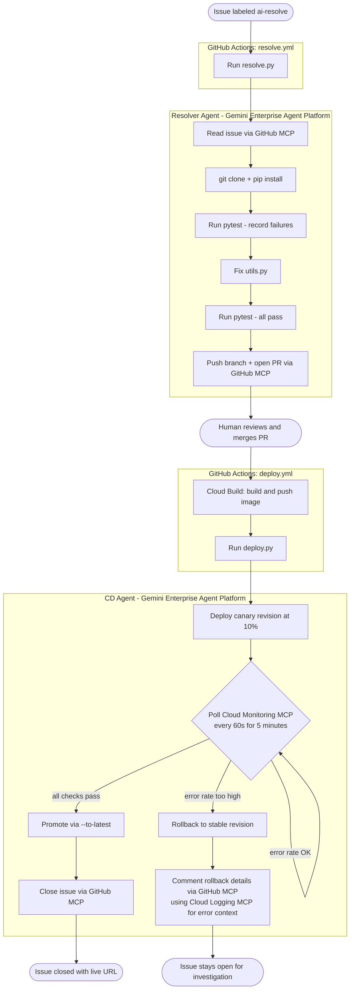

# Autonomous GitHub Issue Resolution with Google Managed Agents API

Enable_GDP_Credits_Banner: True

> aside negative
>
> If you are attending an **instructor-led workshop**: Your instructor will provide you with a credit code. Please use
> the one they provide.

## Overview

Duration: 05:00

In this codelab you will build **Managed Issue Resolver**: a system that autonomously resolves GitHub issues and
deploys fixes to Cloud Run, driven entirely by the Google Managed Agents API on Gemini Enterprise Agent Platform.

Label any issue `ai-resolve`. A managed agent reads the issue via GitHub MCP, clones the repo, reproduces the failure,
fixes the bug, runs the tests, and opens a PR. When you merge the PR, a second managed agent deploys the fix to Cloud
Run using canary traffic splitting, monitors error rates via Cloud Monitoring MCP, then promotes or rolls back
automatically.

No orchestration framework. No LLM wrappers. No custom sandboxes. The Managed Agents API provisions the sandbox,
runs the model, executes code, and streams results. You bring two SKILL.md files, two GitHub Actions workflows,
and three hosted MCP servers.

### What you'll build



### The app you'll fix

A conference session browser showing 12 sessions across 5 tracks (AI & ML, Cloud, Mobile, Web, Security) over 2 days.
The app has four seeded bugs, all in `utils.py`:

| Bug | Symptom |
|---|---|
| Filter by track | Clicking any track filter returns an empty list |
| Filter by day | Filtering by Day 1 or Day 2 returns nothing |
| Speaker search | "eric" does not match "Eric Schmidt" (case-sensitive) |
| Session count | The count badge shows the wrong number |

The agent reads the issue, finds the root cause, fixes the code, and opens a PR. You review and merge it. The CD
agent deploys the fix automatically.

### What you'll learn

- **When to use the Managed Agents API**: when your task requires an LLM with real compute — running tests, executing shell commands, calling git, making HTTP requests — not just text generation.
- **How to use it**: create named agents with `client.agents.create()` and run long-running interactions with `client.interactions.create()` using `background=True`, `stream=True`, and `store=True`.
- **How to configure it**: set a `system_instruction` (AGENTS.md), mount GCS-hosted playbooks (`SKILL.md`) via `base_environment.sources`, and attach built-in tools (`code_execution`, `google_search`, `url_context`).
- **How MCP works with it**: attach hosted MCP servers (GitHub, Cloud Monitoring, Cloud Logging) at interaction time via the `tools` parameter — no deployment, no custom integration code.
- **The advantages**: no sandbox infrastructure to manage, model and compute co-located, named agents created once and reused forever, background execution with streaming for long-running tasks.

### What you'll need

- A Google Cloud project with billing enabled
- A GitHub account and a public GitHub repository
- The `gcloud` CLI and `gh` CLI installed and authenticated
- Python 3.11+ and `uv` installed

## Set Up Your Environment

Duration: 15:00

For this codelab, you'll use Cloud Shell or your local terminal. By the end of this step you'll have the repo
cloned, your GCP project configured, all required APIs enabled, a `.env` file filled in, a service account
created, and GitHub secrets set.

### What is Cloud Shell?

Cloud Shell is a free browser-based Linux terminal with `gcloud`, `git`, `gh`, `uv`, and Python pre-installed.
You don't need to install anything locally to complete this codelab.

To open Cloud Shell, click the terminal icon in the top-right toolbar of the GCP Console. When prompted, click
**Authorize** to allow Cloud Shell to make Google Cloud API calls.

> aside negative
>
> **If Cloud Shell goes idle for 20 minutes it will disconnect.** Reconnect and `cd managed-issue-resolver` to
> return to the working directory.

> aside positive
>
> **Prefer your local terminal?** You'll need `gcloud` CLI, `gh` CLI, `uv`, and Python 3.11+ installed.
> Everything else in this codelab runs identically.

### Clone the repository

```bash
git clone https://github.com/Saoussen-CH/managed-issue-resolver.git
cd managed-issue-resolver
```

> aside positive
>
> **Using this for a demo?** The repo ships with a working target app and seeded bugs. The `setup/` directory contains
> everything you need to configure and reset the demo (no manual file editing required).

### Authenticate and configure your project

```bash
gcloud auth login
gcloud auth application-default login
```

> aside positive
>
> **Why two auth commands?** `gcloud auth login` authenticates the CLI. `gcloud auth application-default login`
> creates credentials that Python scripts (like `create_agents.py` and `deploy.py`) use to call Google Cloud APIs.
> Without the second command, the agent SDK fails with a missing credentials error at runtime.

Then set your project:

```bash
export PROJECT_ID=$(gcloud config get-value project)
export REGION="us-central1"
echo "Project: $PROJECT_ID"
```

Expected output:
```text
Project: my-project-123
```

### Enable required APIs

```bash
gcloud services enable \
    aiplatform.googleapis.com \
    run.googleapis.com \
    cloudbuild.googleapis.com \
    artifactregistry.googleapis.com \
    monitoring.googleapis.com \
    logging.googleapis.com \
    storage.googleapis.com \
    --project $PROJECT_ID
```

This takes about 1 minute. You'll see `Operation finished successfully` when done.

> aside positive
>
> **Why these APIs?** `aiplatform.googleapis.com` is the Managed Agents API. The rest support Cloud Run deployment
> (`run`, `cloudbuild`, `artifactregistry`), skill storage (`storage`), and the hosted MCP servers for monitoring
> and logging.

### Fill in .env

```bash
cp .env.example .env
```

Edit `.env` and replace the two placeholder values:

```
GOOGLE_CLOUD_PROJECT=your-project-id
GCS_SKILLS_BUCKET=managed-issue-resolver-skills-your-project-id
```

Install Python dependencies:

```bash
uv sync
```

> aside negative
>
> **Pick a globally unique bucket name.** GCS bucket names are global, so `my-bucket` will likely be taken.
> A safe pattern: `managed-issue-resolver-skills-{PROJECT_ID}`.

### Create a service account

The GitHub Actions workflows need GCP credentials to call the Managed Agents API, build Docker images, and deploy to
Cloud Run. Create a dedicated service account with the exact roles needed:

```bash
PROJECT_ID=$(grep GOOGLE_CLOUD_PROJECT .env | cut -d= -f2)
SA=managed-issue-resolver@$PROJECT_ID.iam.gserviceaccount.com

gcloud iam service-accounts create managed-issue-resolver \
  --display-name="Managed Issue Resolver" \
  --project=$PROJECT_ID
```

Assign roles:

```bash
for ROLE in \
  roles/aiplatform.user \
  roles/run.admin \
  roles/cloudbuild.builds.editor \
  roles/artifactregistry.writer \
  roles/storage.admin \
  roles/storage.objectViewer \
  roles/mcp.toolUser \
  roles/monitoring.admin \
  roles/logging.admin \
  roles/logging.viewer \
  roles/serviceusage.serviceUsageConsumer \
  roles/iam.serviceAccountUser; do
  gcloud projects add-iam-policy-binding $PROJECT_ID \
    --member="serviceAccount:$SA" \
    --role="$ROLE" --quiet
done
```

Download the key:

```bash
gcloud iam service-accounts keys create sa-key.json \
  --iam-account=$SA --project=$PROJECT_ID
```

> aside negative
>
> **Never commit `sa-key.json`.** The `.gitignore` already excludes it. Always delete the local copy after adding it
> to GitHub Secrets in the next step.

> aside positive
>
> **Why `roles/mcp.toolUser`?** The Cloud Monitoring and Cloud Logging MCP servers require this role to accept
> authenticated requests. Without it, the CD agent gets `403 Forbidden` when querying error rates.

### Add GitHub secrets

The workflows read secrets from the repository. Add them before the first run:

```bash
PROJECT_ID=$(grep GOOGLE_CLOUD_PROJECT .env | cut -d= -f2)

gh secret set GCP_SA_KEY < sa-key.json
gh secret set GCP_PROJECT_ID --body "$PROJECT_ID"
gh secret set CLOUD_RUN_REGION --body "us-central1"
```

Then delete the local key file:

```bash
rm sa-key.json
```

`GITHUB_TOKEN` is provided automatically by GitHub Actions (no action needed).

> aside negative
>
> **Allow pull request creation.** Go to your GitHub repo: **Settings > Actions > General > Workflow permissions**.
> Check: **Allow GitHub Actions to create and approve pull requests**. Without this, the resolver agent cannot open
> a PR and the workflow will fail with a `403` error.

The secrets `GCS_SKILLS_BUCKET`, `RESOLVER_AGENT_ID`, and `CD_AGENT_ID` will be added in the next step after the
bucket and agents are created.

## Understand the Architecture

Duration: 08:00

Before writing any code, let's understand what the Managed Agents API is, and the three concepts that make
this system work: named agents, SKILL.md playbooks, and hosted MCP servers.

### What is the Managed Agents API?

Most LLM APIs give you a text-in, text-out interface: you send a prompt, the model generates a response, done.
That's enough for summarization or Q&A. It's not enough for resolving a GitHub issue - the agent needs to clone
a repo, run tests, write files, and open a PR. For that, the model needs real compute.

The **Managed Agents API** (part of Gemini Enterprise Agent Platform) is an API that runs a Gemini model inside
a fully provisioned Ubuntu sandbox. The model and the compute environment are co-located: the model can run
`bash`, execute Python, call `git`, run `pytest`, and make HTTP requests as part of a single interaction.

```
Your code (GitHub Actions workflow)
        │
        │  POST /v1beta1/projects/.../agents/{id}/interactions
        │  { "input": "Fix issue #42", "tools": [GitHub MCP, ...] }
        ▼
  Gemini Enterprise Agent Platform
        │
        ├─ provisions sandboxed Ubuntu VM
        ├─ mounts skill files from GCS
        ├─ starts Gemini Model Runtime alongside the compute
        │
        │  agent reasons → calls bash → runs pytest → edits files → calls GitHub MCP → opens PR
        │
        └─ streams interaction events back to your workflow
```

**Key advantages over rolling your own agent:**

| | Managed Agents API | Self-hosted (e.g., LangChain + Docker) |
|---|---|---|
| Infrastructure | Zero - platform provisions sandboxes on demand | You build, deploy, and scale the execution environment |
| Sandbox security | Isolated per interaction, auto-cleaned | You manage isolation |
| Long-running tasks | Background execution with `background=True`, up to 15 min | You handle timeouts and polling |
| MCP integration | Hosted MCP servers passed at call time | You deploy or proxy MCP servers |
| Environment snapshots | Auto-snapshot on idle, retained 7 days | You manage state persistence |
| SDK | `google-genai` with `vertexai=True`, three lines to invoke | Framework-specific, more code |

This project uses the API through the `google-genai` Python SDK:

```python
from google import genai

client = genai.Client(vertexai=True, project=PROJECT_ID, location="global")

# Invoke an agent - the platform does the rest
stream = client.interactions.create(
    agent="managed-issue-resolver",   # named agent ID
    input=prompt,                      # what to do
    tools=[github_mcp_server],         # external tools to connect
    stream=True,                       # stream events as they happen
    background=True,                   # don't block while agent runs
    store=True,                        # persist interaction for multi-turn
)
```

### Concept: Named agents on Gemini Enterprise Agent Platform

A naive approach would call `client.models.generate_content()` for each issue, embedding the system prompt,
tool list, and environment config in every request. That works for simple tasks, but it re-sends the full
configuration on every call and gives you no way to reuse a pre-warmed sandbox across invocations.

**Named agents** solve this. You create the agent once with its full configuration, and the platform provisions
a fresh, isolated sandbox from that snapshot on each `client.interactions.create()` call. The agent ID is a
stable reference that your GitHub Actions workflows use forever - you never re-specify the system prompt or
environment config in application code.

A named agent stores:

- A base environment (Ubuntu, Python 3.11, Node 20, Bash, web access)
- A **Model Runtime** (Gemini models run inside the same sandbox alongside your code)
- A system instruction (`AGENTS.md`)
- GCS-mounted skill files (`SKILL.md`)

The execution model looks like this:

```
GitHub Actions workflow
        │
        │  client.interactions.create(agent="managed-issue-resolver", input=prompt, tools=[...])
        ▼
  Gemini Enterprise Agent Platform
        │
        │  provisions fresh sandbox from named agent snapshot
        ├─ mounts SKILL.md from GCS  →  /.agent/skills/fix-issue/
        ├─ loads Model Runtime
        └─ starts agent with AGENTS.md system instruction
              │
              │  agent reasons, calls tools (bash, GitHub MCP, pytest)
              ▼
           streams events back  →  GitHub Actions logs
```

When you call `client.interactions.create(agent=AGENT_ID, ...)`, the platform provisions a fresh sandbox with your
configuration already applied.

```python
from google import genai

client = genai.Client(vertexai=True, project=PROJECT_ID, location="global")

# One-time agent creation (setup/create_agents.py)
client.agents.create(
    id="managed-issue-resolver",
    base_agent="antigravity-preview-05-2026",
    description="Reads a GitHub issue, fixes the bug, runs tests, opens a PR.",
    system_instruction=agents_md_content,
    tools=[
        {"type": "code_execution"},
        {"type": "google_search"},
        {"type": "url_context"},
    ],
    base_environment={
        "type": "remote",
        "sources": [
            {
                "type": "gcs",
                "source": f"gs://{BUCKET}/resolver/skills/fix-issue",
                "target": "/.agent/skills/fix-issue",
            }
        ],
        "network": {"allowlist": [{"domain": "*"}]},
    },
)
```

### Concept: SKILL.md - the agent's playbook

A naive approach would embed all step-by-step instructions in the system instruction (`AGENTS.md`). That works,
but it bloats every sandbox with content the agent only needs at runtime, and updating the playbook means editing
the agent's source instruction and recreating it.

**SKILL.md files** solve this. Each skill is a Markdown document stored in GCS and mounted read-only into the
sandbox at `/.agent/skills/{name}/`. The agent reads it like documentation when it needs to know what steps to
follow. Updating a playbook means uploading a new file to GCS - no code change, no agent recreation.

This project has two skills:

| Skill | Local file | GCS path | Mount path |
|---|---|---|---|
| `fix-issue` | `target-app/.agents/skills/fix-issue/SKILL.md` | `resolver/skills/fix-issue/SKILL.md` | `/.agent/skills/fix-issue/` |
| `deploy` | `cd-agent/SKILL.md` | `cd-agent/skills/deploy/SKILL.md` | `/.agent/skills/deploy/` |

Skill files use frontmatter for discovery and plain Markdown for instructions:

```markdown
---
name: fix-issue
description: Clone a repository, diagnose a bug, fix it, and open a pull request.
---

# Skill: Fix GitHub Issue

## Workflow

1. Read the issue using the GitHub MCP server...
2. Clone the repository...
3. Run the existing tests to see the current failure baseline...
```

### Concept: Hosted MCP servers

A naive approach would write custom Python functions to call the GitHub API, Cloud Monitoring API, and Cloud
Logging API, then register them as tools. That works, but it means writing auth handling, request formatting,
and error handling for every external service.

**Hosted MCP servers** solve this. MCP (Model Context Protocol) is an open standard for exposing APIs as
agent-callable tools. Google and GitHub host MCP servers for their APIs - you pass the URL and auth headers at
interaction time, and the agent gets a full set of typed tools with no code required.

This project uses three hosted MCP servers (no deployment required):

| Server | URL | Used by |
|---|---|---|
| GitHub | `https://api.githubcopilot.com/mcp/` | Both agents: read issues, open PRs, post comments |
| Cloud Monitoring | `https://monitoring.googleapis.com/mcp` | CD agent: query `run.googleapis.com/request_count` |
| Cloud Logging | `https://logging.googleapis.com/mcp` | CD agent: fetch error logs on rollback |

MCP servers are passed at interaction time via the `tools` parameter:

```python
stream = client.interactions.create(
    agent=AGENT_ID,
    input=prompt,
    tools=[
        {
            "type": "mcp_server",
            "url": "https://api.githubcopilot.com/mcp/",
            "headers": {
                "Authorization": f"Bearer {GH_TOKEN}",
                "X-MCP-Exclude-Tools": "delete_file",   # avoids name conflict
            },
        },
    ],
    stream=True,
    background=True,
    store=True,
)
```

> aside positive
>
> **Why `X-MCP-Exclude-Tools: delete_file`?** The GitHub MCP server exposes a `delete_file` tool. The Managed Agents
> sandbox also provides a built-in `delete_file` tool for the local filesystem. Having two tools with the same name
> causes a conflict that crashes the interaction. Excluding the GitHub MCP's `delete_file` avoids this.

## Create Named Agents

Duration: 08:00

In this step you'll create a GCS bucket, upload both SKILL.md playbooks, register the two named agents on
Gemini Enterprise Agent Platform, and verify they initialize correctly before triggering any workflow.

### Upload skills to GCS

SKILL.md files are stored in GCS and mounted into the agent sandbox at runtime. Create the bucket and upload both
files:

```bash
PROJECT_ID=$(grep GOOGLE_CLOUD_PROJECT .env | cut -d= -f2)
GCS_SKILLS_BUCKET=$(grep GCS_SKILLS_BUCKET .env | cut -d= -f2)

gcloud storage buckets create gs://$GCS_SKILLS_BUCKET \
  --location=us-central1 \
  --project=$PROJECT_ID
```

Add the bucket name as a GitHub secret:

```bash
gh secret set GCS_SKILLS_BUCKET --body "$GCS_SKILLS_BUCKET"
```

Upload both SKILL.md files:

```bash
bash setup/upload_skills.sh
```

Expected output:
```text
Uploading skills to gs://managed-issue-resolver-skills-my-project ...
[gsutil copy output]

Skills uploaded:
gs://managed-issue-resolver-skills-my-project/cd-agent/skills/deploy/SKILL.md
gs://managed-issue-resolver-skills-my-project/resolver/skills/fix-issue/SKILL.md

Note: recreate agents after changing SKILL.md files:
  uv run python setup/create_agents.py
```

> aside positive
>
> **Re-run `upload_skills.sh` whenever you edit a SKILL.md file.** The GCS object is the live version the agent reads
> at runtime. Local edits have no effect until you upload. After uploading, you also need to recreate the agents
> (the skill is mounted at agent creation time, not at invocation time).

### Register agents

Run `create_agents.py` once to register both named agents on Gemini Enterprise Agent Platform:

```bash
uv run python setup/create_agents.py
```

The script prints the `gh secret set` commands for both agent IDs. Run them:

```bash
gh secret set RESOLVER_AGENT_ID --body "managed-issue-resolver"
gh secret set CD_AGENT_ID --body "managed-issue-cd"
```

Verify the agents initialize correctly before triggering the workflow:

```bash
uv run python setup/test_agents.py
```

Expected output:
```text
Testing: managed-issue-resolver
  Prompt: Say hello and confirm you can access the GitHub MCP server.
  interaction.created
  PASS: agent initialized and completed successfully

Testing: managed-issue-cd
  Prompt: Say hello and confirm you can access the GitHub, Cloud Monitoring, and Cloud Loggi
  interaction.created
  PASS: agent initialized and completed successfully

========================================
All agents OK. Ready to trigger the workflow.
```

> aside positive
>
> **Agent IDs are permanent.** Once created, the agent ID never changes. Re-run `upload_skills.sh` and then
> `create_agents.py` only if you change SKILL.md files or delete the agents. The GitHub secrets never need
> updating once set.

> aside negative
>
> **If you see `GOOGLE_CLOUD_PROJECT: KeyError`**, your `.env` file is not filled in or not being loaded. Check
> that `GOOGLE_CLOUD_PROJECT=your-project-id` is set correctly in `.env` and that you ran the command from the
> repo root.

## Deploy the Target App

Duration: 05:00

The target app is a conference session browser with four seeded bugs. You'll deploy the broken version to Cloud
Run now so the CD agent has a live service to update when the resolver agent's fix is merged.

Create an Artifact Registry repository to store the Docker images that Cloud Build will produce:

```bash
PROJECT_ID=$(grep GOOGLE_CLOUD_PROJECT .env | cut -d= -f2)

gcloud artifacts repositories create managed-issue-resolver \
  --repository-format=docker \
  --location=us-central1 \
  --project=$PROJECT_ID
```

Deploy the initial (broken) version of the conference session browser to Cloud Run:

```bash
gcloud run deploy target-app \
  --source target-app/ \
  --region us-central1 \
  --allow-unauthenticated \
  --project=$PROJECT_ID
```

This takes 2-3 minutes. When complete, you'll see:

```text
Service URL: https://target-app-xxxx.us-central1.run.app
```

Open the URL in your browser. Click any track filter: notice the session list goes empty. That is the first of four
seeded bugs the agent will fix.

> aside negative
>
> **`--allow-unauthenticated` is intentional here.** It makes the app publicly accessible for demo purposes. In
> production, remove this flag and add IAM-based authentication.

## Trigger Issue Resolution

Duration: 10:00

The resolver workflow fires when a GitHub issue gets the `ai-resolve` label. You'll create the label, open an
issue describing the bug, watch the agent fix it, then review and merge the PR it opens.

### Create the `ai-resolve` label

The GitHub Actions `resolve.yml` workflow fires when an issue is labeled `ai-resolve`:

```bash
gh label create ai-resolve --color "0075ca" --description "Trigger AI issue resolution"
```

### Open an issue

```bash
gh issue create \
  --title "Track filter returns no sessions" \
  --body "When clicking any track filter (AI & ML, Cloud, Mobile, etc.) the session list becomes empty. All sessions disappear regardless of which track is selected.

Expected: only sessions matching the selected track should appear.

Bug is in \`target-app/utils.py\`." \
  --label "ai-resolve"
```

The `ai-resolve` label triggers the workflow immediately.

### Watch the agent work

```bash
gh run watch
```

You'll see the GitHub Actions run progress through these steps:

```text
✓ Checkout
✓ Set up Python
✓ Install dependencies
✓ Authenticate to Google Cloud
✓ Comment on issue
● Run resolver agent    <- agent is working here
```

The "Comment on issue" step posts a message to the issue: "Agent is working on this. A PR will appear here when
the fix is ready."

### What the agent does

While the workflow is running, the Managed Agent is executing inside a hosted sandbox:

1. **Reads the issue** via GitHub MCP (gets the title, body, and issue number)
2. **Clones the repo** using the authenticated URL injected via the prompt
3. **Installs dependencies** from `requirements.txt`
4. **Runs pytest** (records which tests fail: all 4 filter tests)
5. **Reads `utils.py`** and finds the root causes:
   - `filter_by_track` normalizes `"AI & ML"` to `"ai-and-ml"` but sessions store `"AI & ML"`
   - `filter_by_day` compares string `"1"` to integer `1` (never equal)
   - `search_by_speaker` uses case-sensitive `in` operator
   - `session_count` counts from the full list instead of the filtered one
6. **Writes the fix**: targeted edits to `utils.py`
7. **Runs pytest again**: all 4 tests pass
8. **Pushes a branch** `fix/issue-1` and opens a PR via GitHub MCP

> aside positive
>
> **The agent never calls your code directly.** It runs `pytest` inside the sandbox the same way a developer would
> on their laptop. If the tests fail after the fix, the agent iterates: it does not open a PR until all tests pass.

> aside negative
>
> **Run takes 3-5 minutes.** The agent reasons step by step, so it is slower than running pytest yourself. This is
> expected. If the run exceeds 15 minutes, the sandbox auto-snapshots and the interaction ends (this rarely happens
> for a single-file fix).

### Review and merge the PR

When the workflow completes, check the open PRs:

```bash
gh pr list
```

You should see one PR from `fix/issue-1`:

```text
#2  fix: track filter returns no sessions (closes #1)  fix/issue-1
```

Review the diff:

```bash
gh pr diff 2
```

The agent should have changed `utils.py` to:
- Remove the slug normalization in `filter_by_track` (compare directly without lowercasing)
- Cast `day` to `int` in `filter_by_day`
- Use `.lower()` in `search_by_speaker`
- Replace `len(SESSIONS)` with `len(sessions)` in `session_count`

Merge it:

```bash
gh pr merge 2 --squash --delete-branch
```

This triggers the CD workflow immediately.

> aside positive
>
> **Always review before merging.** The agent is autonomous but you are the last line of defense. Check that the
> fix is targeted: only the four buggy functions should change. If the agent modified unrelated files or added
> unnecessary code, close the PR and re-open the issue.

## Watch the CD Agent Deploy

Duration: 08:00

Merging the PR triggers the CD workflow. The CD agent follows a canary deployment strategy: deploy at 10%
traffic, monitor error rates for 5 minutes via Cloud Monitoring MCP, then promote or roll back automatically.

### What the CD workflow does

Merging the PR triggers `deploy.yml`, which:

1. Authenticates to GCP using the service account key
2. Runs `gcloud builds submit --async` to build the Docker image from `target-app/`
3. Polls `gcloud builds describe` every 15 seconds until the build completes
4. Calls `cd-agent/deploy.py` with the PR URL and image URL

`deploy.py` then calls `client.interactions.create(agent=CD_AGENT_ID, ...)` and streams the CD agent's output.

### What the CD agent does

The CD agent follows the `deploy` skill playbook:

1. **Records the stable revision**: saves the current revision name before deploying
2. **Deploys with `--no-traffic`**: the new image is deployed but gets zero requests
3. **Splits traffic at 10%**: `gcloud run services update-traffic --to-revisions NEW_REV=10`
4. **Monitors for 5 minutes**: queries Cloud Monitoring MCP every 60 seconds for `run.googleapis.com/request_count`
5. **Promotes or rolls back**:
   - If error rate stays below 5%: `--to-latest` (promotes new revision to 100%)
   - If error rate spikes: `--to-revisions STABLE_REV=100` (rolls back instantly)
6. **Closes the linked issue** via GitHub MCP (posts the live URL and closes the issue)

Watch the workflow:

```bash
gh run watch
```

When the CD agent completes, check the linked issue is closed:

```bash
gh issue list --state closed
```

And verify the fix is live in your browser: the track filter should now work.

> aside positive
>
> **Why `--to-latest` on promotion?** If you use `--to-revisions NEW_REV=100`, Cloud Run enters "manual traffic
> mode." Future deployments create new revisions but get no traffic until you manually update the traffic config.
> Using `--to-latest` keeps the service in automatic mode where each new deploy automatically becomes the active
> revision.

> aside negative
>
> **If the CD agent times out**: This is rare but can happen if Cloud Build takes longer than expected. Re-trigger
> by re-merging the PR or running `uv run python cd-agent/deploy.py <pr_url> <image_url>` locally.

## Clean Up

Duration: 03:00

### Reset for another run

To run the demo again without starting from scratch, use the reset script:

```bash
bash setup/reset_demo.sh
```

The script:

1. **Waits** for any in-progress CD workflows to finish (polls every 15 seconds)
2. **Closes** all open PRs (agent-opened or otherwise)
3. **Restores** `target-app/utils.py` from `setup/utils_broken.py` (the canonical broken version)
4. **Commits and pushes** the reset to master
5. **Redeploys** the broken app to Cloud Run with `gcloud run deploy --source`

When done:
```text
Done. Demo is reset and ready.
Open a new issue with the 'ai-resolve' label to trigger the agent.
```

You can now repeat from the Trigger Issue Resolution step.

> aside positive
>
> **Why `setup/utils_broken.py`?** The reset script copies from this canonical file rather than reverting with git.
> The agent never writes to `setup/` (it only clones `target-app/`), so `utils_broken.py` is never accidentally
> modified. It is always the correct broken state regardless of agent activity.

> aside negative
>
> **Push conflicts after CD workflow**: If a CD workflow was running when you started the reset, `git push` may be
> rejected with a non-fast-forward error. Run `git pull --rebase && git push` to resolve.

### Remove all resources

Remove all Google Cloud resources to avoid ongoing charges.

Delete the Cloud Run service:

```bash
PROJECT_ID=$(grep GOOGLE_CLOUD_PROJECT .env | cut -d= -f2)

gcloud run services delete target-app \
  --region=us-central1 \
  --project=$PROJECT_ID --quiet
```

Delete the Artifact Registry repository:

```bash
gcloud artifacts repositories delete managed-issue-resolver \
  --location=us-central1 \
  --project=$PROJECT_ID --quiet
```

Delete the GCS skills bucket:

```bash
GCS_SKILLS_BUCKET=$(grep GCS_SKILLS_BUCKET .env | cut -d= -f2)

gcloud storage rm -r gs://$GCS_SKILLS_BUCKET
```

Delete the named agents:

```bash
uv run python setup/delete_agents.py
```

Delete the service account:

```bash
SA=managed-issue-resolver@$PROJECT_ID.iam.gserviceaccount.com

gcloud iam service-accounts delete $SA \
  --project=$PROJECT_ID --quiet
```

### Verify everything is removed

```bash
gcloud run services list --region=us-central1 --project=$PROJECT_ID
gcloud storage buckets list --project=$PROJECT_ID
```

Expected output: empty lists or only your own pre-existing resources.

## Summary

Duration: 02:00

Congratulations! You've built an autonomous AI-driven issue resolution and deployment pipeline on Google Cloud.

### What you built

| Component | Role |
|---|---|
| **Resolver Agent** | Reads GitHub issues, clones the repo, fixes bugs, opens PRs |
| **CD Agent** | Canary-deploys fixes, monitors error rates, promotes or rolls back |
| **GitHub MCP** | Gives both agents access to the GitHub API (no custom integration code) |
| **Cloud Monitoring MCP** | Gives the CD agent live error rate data during canary monitoring |
| **Cloud Logging MCP** | Gives the CD agent error log context when a rollback happens |

### Key patterns you learned

1. **Named agents**: create once, reuse across interactions; system instruction lives in `AGENTS.md`
2. **SKILL.md**: package step-by-step playbooks in GCS-mounted Markdown files; no prompt engineering in code
3. **Hosted MCP servers**: connect GitHub, Cloud Monitoring, and Cloud Logging at interaction time (zero deployment)
4. **`X-MCP-Exclude-Tools`**: prevent tool name conflicts between MCP servers and the sandbox built-ins
5. **`background=True` + `store=True`**: run long agent interactions asynchronously and stream events
6. **Canary traffic splitting**: `--no-traffic` deploy, then `--to-revisions NEW_REV=10`, then `--to-latest` promote
7. **`setup/utils_broken.py`**: keep a canonical broken state outside the agent's working directory for reliable reset

### Next steps

- Extend the resolver SKILL.md to handle multi-file bugs or JavaScript projects
- Add a second issue type (performance regression, wrong output format) and trigger it with a different label
- Replace the canary monitoring interval: try querying every 30 seconds for 10 minutes
- Explore multi-turn interactions using `environment=<env_id>` + `previous_interaction_id=<interaction_id>`
- Add a Slack MCP server to post deployment notifications

### Resources

- [Managed Agents API Quickstart](https://ai.google.dev/gemini-api/docs/managed-agents-quickstart)
- [Gemini Enterprise Agent Platform Docs](https://cloud.google.com/vertex-ai/generative-ai/docs/agent-engine/overview)
- [Model Context Protocol](https://modelcontextprotocol.io/)
- [Cloud Run Traffic Splitting](https://cloud.google.com/run/docs/rollouts-rollbacks-traffic-migration)
- [google-genai Python SDK](https://github.com/googleapis/python-genai)
